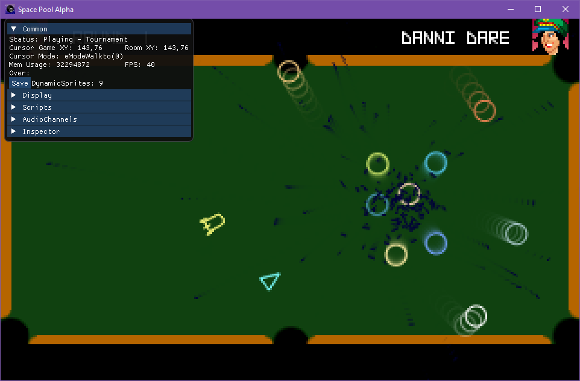

# SpacePoolAlpha

_An intergalactic arcade pool simulation.  Featuring time attack, tournament and two-player modes._

Game and Art by [Ben Chandler](https://twitter.com/ben_304). Music by Sebastian Pfaller. Ported to XAGE by [Dan Alexander](https://twitter.com/clarvalon).

Programming and Game Design by [Steve McCrea](https://twitter.com/Kweepa).
Portraits and victory screen by [AngelicCharon](https://www.adventuregamestudio.co.uk/forums/index.php?action=profile;u=9030).
Music by [m0ds](https://www.adventuregamestudio.co.uk/forums/index.php?action=profile;u=16896).  
Additional game design and testing by [bicilotti](https://www.adventuregamestudio.co.uk/forums/index.php?topic=33343.msg432375#msg432375).
Port to XAGE by [Dan Alexander](https://twitter.com/Clarvalon)

## Prerequisites

* __Windows7+ x64__ is required for development (although x86 game executables can be produced).

* __[Visual Studio](https://www.visualstudio.com/downloads/)__ (2019 and up, with .NET Core 3 installed - the Community Edition is fully featured and free for small teams).  It is also possible to use __[VS Code](https://code.visualstudio.com/)__.

* __[Cross-Platform Adventure Game Engine (XAGE)](https://clarvalon.com)__.

## Getting Started

1. Clone this repository.

1. Open the project in XAGE Editor (Content\Game.xag).

1. Click Run button to build content and debug using Visual Studio.  The build process will:

    * Prepare raw assets into .zip files.
    * Create any missing autogenerated code.
    * Ensure the latest runtime DLLs are in place.

For more information, please see [here](https://clarvalon.com/documentation/gettingstarted).

## Publishing

To publish a standalone executable for easy distribution on Desktop platforms, navigate to the Publish directory and run the relevant .bat file.  These .bat files can be edited to fit your individual needs.  

To prevent the console window from appearing in Windows, ensure you have set the project's output type to 'Windows Application'.

There are some additional options that can be added to your .csproj that you can make to change the publish process:

* The [PublishTrimmed](https://docs.microsoft.com/en-us/dotnet/core/whats-new/dotnet-core-3-0#assembly-linking) option can reduce the DLL size considerably, as it will remove framework code not being used.  It is not foolproof however and you may need to add 'TrimmerRootAssembly' items to ensure needed code is not trimmed away.

* The [PublishReadyToRun](https://docs.microsoft.com/en-us/dotnet/core/whats-new/dotnet-core-3-0#readytorun-images) option can pre-compile some of the code for the given platform, which can give a modest boost to startup time at the cost of size.

Additionally, [Warp](https://github.com/dgiagio/warp#quickstart-with-net-core) can be used to create a single-executable for distribution.  In future this may be possible with the [PublishSingleFile](https://docs.microsoft.com/en-us/dotnet/core/whats-new/dotnet-core-3-0#single-file-executables) option once it matures.

OR - it is also possible to compile using the experimental CoreRT platform by following the instructions [here](https://github.com/dotnet/corert/tree/master/samples/HelloWorld).

## License

This project is licensed under the MIT License - see the [license](license.md) file for details.
